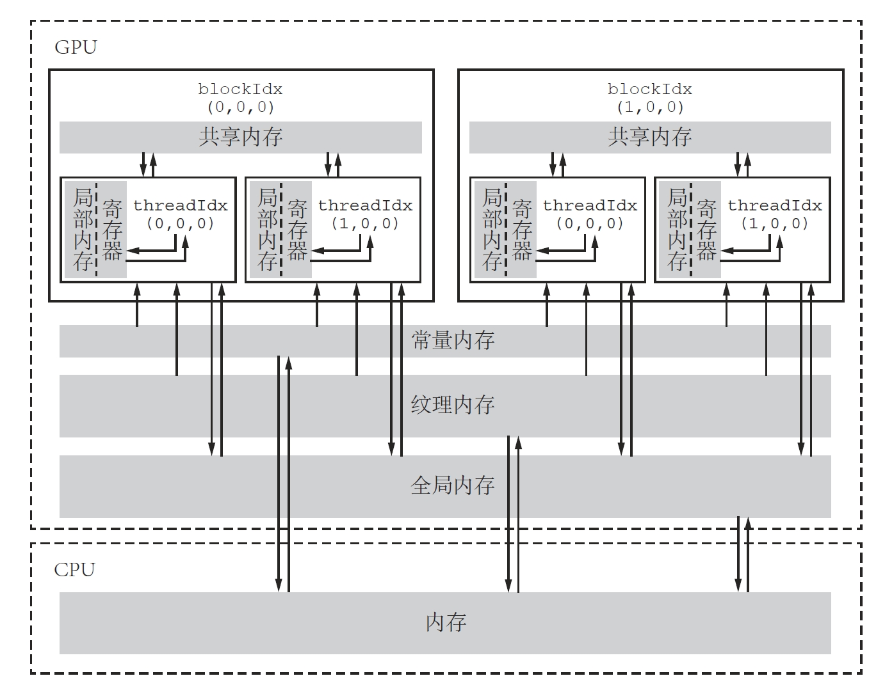

# CUDA 编程笔记

- [CUDA 编程笔记](#cuda-编程笔记)
    - [1. 典型的CUDA程序基本框架](#1-典型的cuda程序基本框架)
    - [2. CUDA编程规范](#2-cuda编程规范)
    - [3. 常用的CUDA计时函数](#3-常用的cuda计时函数)
    - [4. CUDA程序性能剖析](#4-cuda程序性能剖析)
    - [5. GPU加速的关键因素](#5-gpu加速的关键因素)
    - [6. CUDA中设备内存的分类与特征](#6-cuda中设备内存的分类与特征)


### 1. 典型的CUDA程序基本框架

```cpp
头文件包含
常量定义（或者宏定义）
C++ 自定义函数和 CUDA 核函数的声明（原型）

int main(void)
{
    分配主机与设备内存
    初始化主机中的数据
    将某些数据从主机复制到设备
    调用核函数在设备中进行计算
    将某些数据从设备复制到主机
    释放主机与设备内存
}

C++ 自定义函数和 CUDA 核函数的定义
```

### 2. CUDA编程规范

- 为了区分主机和设备中的变量，遵循CUDA编程的传统，用`d_`前缀表示设备变量，用`h_`前缀表示主机变量。

### 3. 常用的CUDA计时函数

```cpp
#include "error.cuh"

cudaEvent_t start, stop;
CHECK(cudaEventCreate(&start));
CHECK(cudaEventCreate(&stop));
CHECK(cudaEventRecord(start));
cudaEventQuery(start);  // 此处不能用 CHECK 宏函数（见第 4 章的讨论）

需要计时的代码块 （主机代码、设备代码、混合代码）

CHECK(cudaEventRecord(stop));
CHECK(cudaEventSynchronize(stop));
float elapsed_time;
CHECK(cudaEventElapsedTime(&elapsed_time, start, stop));
printf("Time = %g ms.\n", elapsed_time);

CHECK(cudaEventDestroy(start));
CHECK(cudaEventDestroy(stop));
```

### 4. CUDA程序性能剖析

**(1) 通过`nvprof`工具进行性能剖析，可以查看程序的运行时间、内存使用情况、核函数的调用次数等信息**。（8.0算力以下可以用）

```bash
nvprof ./a.out
```

注：8.0以上算力显卡会报错：

```bash
E:\Code_Exe\CUDA_Notes\CUDA_Code\chapter5>nvprof .\add3memory.exe 
======== Warning: nvprof is not supported on devices with compute capability 8.0 and higher.
                  Use NVIDIA Nsight Systems for GPU tracing and CPU sampling and NVIDIA Nsight Compute for GPU profiling.
                  Refer https://developer.nvidia.com/tools-overview for more details.
```

**(2) 使用`Nsight Systems`工具进行性能剖析**（8.0及以上算力）。

```bash
# nsys profile --stats=true -o report_name ./your_program
nsys profile --stats=true .\add3memory_dp.exe
```

- `profile` 是 Nsight Systems 的主要命令，表示进行性能分析。
- `--stats=true` 表示在分析后打印统计信息。
- `-o report_name` 表示生成的报告文件名。
- `./your_program` 是要分析的可执行程序。

这个命令会生成一个`.qdrep`格式的报告文件，它包含详细的性能数据。

注：使用过程中可能会遇到:
```bash
Unexpected exception thrown while launching the application.
Dynamic exception type: class std::range_error
std::exception::what: bad conversion
```
原因是`nsys`的版本过旧，和cuda11.8不匹配，下载安装[nsys2024.6.1](https://developer.nvidia.com/tools-downloads)，并添加环境变量(`C:\Program Files\NVIDIA Corporation\Nsight Systems 2024.6.1\target-windows-x64`)+重启之后，运行代码，即可通过。

**(3) 使用`Nsight Compute`工具进行性能分析**

```bash
ncu -o profile_result .\add3memory.exe
```


### 5. GPU加速的关键因素

一个CUDA程序能够获得高性能的必要（但不充分）条件有如下几点：

* 数据传输比例较小；
* 核函数的算术强度较高；
* 核函数中定义的线程数目较多。

所以在编写和优化CUDA程序时，要做到以下几点：

* 减少主机与设备之间的数据传输；
* 提高核函数的算术强度；
* 增大核函数的并行规模。

### 6. CUDA中设备内存的分类与特征

| 内存类型 | 物理位置 | 访问权限 | 可见范围 | 生命周期 |
| :---: | :---: | :---: | :---: | :---: |
| 全局内存 | 在芯片外 | 可读可写 | 所有线程和主机端 | 由主机分配与释放 |
| 常量内存 | 在芯片外 | 仅可读   | 所有线程和主机端 | 由主机分配与释放 |
| 纹理和表面内存 | 在芯片外 | 一般仅可读 | 所有线程和主机端 | 由主机分配与释放 |
| 寄存器内存 | 在芯片内 | 可读可写 | 单个线程 | 所在线程 |
| 局部内存   | 在芯片外 | 可读可写 | 单个线程 | 所在线程 |
| 共享内存   | 在芯片内 | 可读可写 | 单个线程块 | 所在线程块 |

`一个线程块（无论是几维的）中的线程数不能超过1024`。

如图所示：
<div style="text-align: center;">
    
</div>

- **全局内存**（global memory）：核函数中的所有线程都能够访问其中的数据，主要角色是为核函数提供数据，并在主机与设备及设备与设备之间传递数据。使用`cudaMalloc`函数为全局内存变量分配设备内存。可以直接在核函数中访问分配的内存，改变其中的数据值。`在各种设备内存中，全局内存具有最低的访问速度（最高的延迟），往往是一个CUDA程序性能的瓶颈`。
```cpp
// 将M字节的数据从主机复制到设备
cudaMemcpy(d_x, h_x, M, cudaMemcpyHostToDevice);
// 将M字节的数据从设备复制到主机
cudaMemcpy(h_z, d_z, M, cudaMemcpyDeviceToHost);
// 将一段全局内存中的数据复制到另一段全局内存中
cudaMemcpy(d_x, d_y, M, cudaMemcpyDeviceToDevice);
// 全局内存可读可写
d_z[n] = d_x[n] + d_y[n];
```

- **常量内存**（constant memory）：是有常量缓存的全局内存，数量有限，一共仅有64KB。可见范围和生命周期与全局内存一样。常量内存仅可读、不可写。由于有缓存，常量内存的访问速度比全局内存高，但得到高访速度的前提是一个线程束中的线程（一个线程块中相邻的32个线程）要读取相同的常量内存数据。

- **纹理内存、表面内存**（textrue memory、surface memory）：类似于常量内存，也是一种具有缓存的全局内存，有相同的可见范围和生命周期，而且一般仅可读（表面内存也可写）。不同的是，纹理内存和表面内存容量更大，而且使用方式和常量内存也不一样。

- **寄存器**（register）：在核函数中定义的不加任何限定符的变量一般来说就存放于寄存器中。核函数中定义的不加任何限定符的数组有可能存放于寄存器中，但也有可能存放于局部内存中。另外，内建变量，如gridDim、blockDim、blockIdx、threadIdx及warpSize等都保存在特殊的寄存器中。在核函数中访问这些内建变量是很高效的。寄存器可读可写。**寄存器内存在芯片上（on-chip），是所有内存中访问速度最高的，但是其数量也很有限制**。一个寄存器占有32 bit（4字节）的内存。一个双精度浮点数将使用两个寄存器。
```cpp
// 定义一个寄存器变量n并将赋值号右边计算出来的值给它（写入）
const int n = blockDim.x * blockIdx.x + threadIdx.x;
// 读取寄存器变量n的值
z[n] = x[n] + y[n];
```
寄存器变量仅仅被一个线程可见。也就是说，每一个线程都有一个变量n的副本。虽然在核函数的代码中用了同一个变量名，但是不同的线程中该寄存器变量的值是可以不同的。每个线程都只能对它的副本进行读写。寄存器的生命周期也与所属线程的生命周期一样，从它定义开始，到线程消失时结束。

- **共享内存**（shard memory）：共享内存和寄存器类似，存在于芯片上，具有仅次于寄存器的读写速度，数量也有限。不同于寄存器的是，共享内存对整个线程块可见，其生命周期也与整个线程块一致。也就是说，每个线程块拥有一个共享内存变量的副本。共享内存变量的值在不同的线程块中可以不同。一个线程块中的所有线程都可以访问该线程块的共享内存变量副本，但是不能访问其他线程块的共享内存变量副本。**共享内存的主要作用是减少对全局内存的访问，或者改善对全局内存的访问模式**。

- **L1和L2缓存**


**流多处理器——SM（Streaming Multiprocessor）**

一个GPU是由多个SM构成的，一个SM包含如下资源：
- 一定数量的寄存器
- 一定数量的共享内存
- 常量内存的缓存
- 纹理和表面内存的缓存
- L1缓存
- 两个或4个线程束调度器（warp shceduler），用于在不同线程的上下文之间迅速地切换，以及为准备就绪的线程束发出执行指令
- 执行核心，包括：
  - 若干整型数运算的核心（INT32）
  - 若干单精度浮点数运算的核心（FP32）
  - 若干双精度浮点数运算的核心（FP64）
  - 若干单精度浮点超越函数（transcendental functions）的特殊函数单元（Special Function Units, SFUs）
  - 若干混合精度的张量核心（tensor cores）
