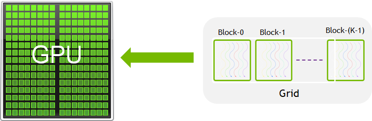
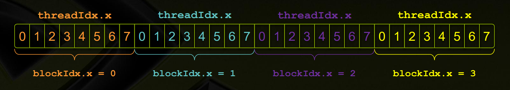

# CUDA 编程笔记

- [CUDA 编程笔记](#cuda-编程笔记)
    - [0. CUDA编程简介](#0-cuda编程简介)
    - [1. CUDA线程层次结构](#1-cuda线程层次结构)
    - [2. 典型的CUDA程序基本框架](#2-典型的cuda程序基本框架)
    - [3. 多线程并行计算](#3-多线程并行计算)
    - [4. CUDA编程规范](#4-cuda编程规范)
    - [5. 常用的CUDA计时函数](#5-常用的cuda计时函数)
    - [6. CUDA程序性能剖析](#6-cuda程序性能剖析)
    - [7. GPU加速的关键因素](#7-gpu加速的关键因素)
    - [8. CUDA中设备内存的分类与特征](#8-cuda中设备内存的分类与特征)
    - [9. 线程束基本函数与协作组](#9-线程束基本函数与协作组)
    - [10. CUDA 流](#10-cuda-流)
    - [11. 统一内存](#11-统一内存)
    - [12. CUDA标准库](#12-cuda标准库)

---
### 0. CUDA编程简介
CUDA是一个为支持CUDA的GPU提供的平台和编程模型。该平台使GPU能够进行通用计算。CUDA提供了C/C++语言扩展和API，以便用户利用GPU进行高效计算。一般称CPU为host，GPU为device。

CUDA C++语言中有一个加在前面的关键字`__global__`，用于表明该函数是运行在GPU上的，并且可以被CPU调用，这种函数被称为kernel。

当我们调用kernel的时候，需要在函数名和括号之间加上`<<<M, T>>`，这个符号表示我们要启动一个kernel，并且在这个符号中间的参数表示我们要启动的线程块的数量和每个线程块中的线程数量。其中`M`是block的个数，`T`是每个block中的线程个数。这些线程都是并行执行的，每个线程中都在执行该函数。

GPU在同一时刻运行一个kernel（也就是一组任务），kernel运行在grid上，每个grid由多个block组成（他们都是独立的ALU组），每个block有多个线程。



同一block中的线程一般合作完成任务，它们可以共享内存（这部分内存速度极快，用`__shared__`关键字声明）。每个线程“知道”它在哪个block（通过访问内置变量`blockIdx.x`）和它是第几个线程（通过访问变量`threadIdx.x`），以及每个block有多少个线程（`blockDim.x`），从而确定它应该完成什么任务。实际上线程和block的索引是三维的，这里只举了一个一维的例子。



注意GPU和CPU的内存是隔离的，想要操作显存或者在显存和CPU内存之间进行交流必须显式的声明这些操作。指针也是不一样的，有可能虽然是`int*`，但表示的含义却不同：device指针指向显存，host指针指向CPU内存。CUDA提供了操作内存的内置函数：`cudaMalloc`、`cudaFree`、`cudaMemcpy`等，它们分别类似于C函数`malloc`、`free`和`memcpy`。

关于同步方面，内置函数`__syncthreads()`可以同步一个block中的所有线程。在CPU中调用内置函数`cudaDeviceSynchronize()`可以阻塞CPU，直到所有先前发出的CUDA调用都完成为止。

另外还有`__host__`关键字和`__device__`关键字，前者表示该函数只编译成CPU版本（这是默认状态），后者表示只编译成GPU版本。二者同时使用表示编译CPU和GPU两个版本。从CPU调用`__device__`函数和从GPU调用`__host__`函数都会报错。

---
### 1. CUDA线程层次结构

1. **threadIdx.x**
- 表示线程在其所属块内的索引
- 范围：0到(blockDim.x - 1)
- 例如：如果`blockDim.x = 256`，则`threadIdx.x`的范围是0-255。
  
2. **blockDim.x**
- 表示每个块内的线程数量
- 在核函数启动时通过`<<<...>>>`语法指定
- 例如：`kernel<<<grid_size, 256>>>`，此时，`blockDim.x = 256`

3. **blockIdx.x**
- 表示当前块在网格中的索引
- 范围：从0到(gridDim.x - 1)
- 例如：如果启动4个块，则`blockIdx.x`的范围是0-3。

**层次结构示意图**：
```bash
Grid（网格）
├── Block 0 (blockIdx.x = 0)
│   ├── Thread 0 (threadIdx.x = 0)
│   ├── Thread 1 (threadIdx.x = 1)
│   ├── ...
│   └── Thread 255 (threadIdx.x = 255)
├── Block 1 (blockIdx.x = 1)
│   ├── Thread 0 (threadIdx.x = 0)
│   ├── Thread 1 (threadIdx.x = 1)
│   ├── ...
│   └── Thread 255 (threadIdx.x = 255)
└── ... (更多块)
```

**代码示例**：

`block 的索引 * 每个 block 的 thread 个数 + block 内的 thread 索引计算出全局索引`

```cpp
// 计算全局线程索引
int global_idx = blockDim.x * blockIdx.x + threadIdx.x;

// 例如：
// 如果 blockDim.x = 256, blockIdx.x = 1, threadIdx.x = 5
// 则 global_idx = 256 * 1 + 5 = 261
```

**常见使用场景**：
- 访问数组元素时计算索引
- 划分数据以便并行处理
- 确保线程不越界

4. **warp_idx**
- 表示当前线程在当前block中是第几个warp（warp会选择相邻的线程号做组合）

5. **calc_idx**
- 表示当前线程计算的是全局的第几个thread；

6. **Warp与Bank**
- **Warp**是CUDA中**线程调度**的基本单位，由连续的32个线程组成。GPU的SIMT（单指令多线程）架构要求同一Warp内的所有线程执行相同的指令，但可以处理不同的数据。
  - 线程块（block）由多个warp组成（例如，一个包含256线程的block被分为8个warp）
  - **Warp大小**：NVIDIA GPU的warp固定为32线程
  - 执行方式：
    - 所有线程在warp中同步执行;
    - 若线程间存在分支（如条件语句），可能导致**Warp Divergence**，即部分线程空闲，从而降低效率。
  - 优化策略：
    - 交叉寻址，使得连续的线程访问的地址不再连续；
    - 这样可以避免warp divergence，但会导致bank conflict。

- **Bank**是共享内存（Shared Memory）的**逻辑分区**，用于提高并行访问效率。共享内存被划分为多个bank（通常为32个），每个bank可独立响应访问请求。
  - **Bank数量**：通常为32，与warp大小对齐（每个bank对应warp中的一个线程）
  - **Bank冲突**（Bank Conflict）：
    - 同一个Block的线程会共享一块共享内存；
    - 当同一warp中的多个线程同时访问同一bank的不同地址时，会导致串行化访问，增加延迟；
    - 在最坏的情况下，即一个warp中的所有线程访问了相同bank的32个不同地址的话，那么这32个访问操作将会全部被序列化，大大降低了内存带宽；
    - 在一个warp内对同一个bank中的$n$地址同时访问将导致$n$次内存事务，称为发生了$n$路bank conflict；
    - 注意，不同warp中的线程之间不存在bank conflict；
    - 若多个线程访问同一bank的同一地址，则出发**广播**（Broadcast），无冲突。
  - 访问规则：
    - 理想情况：同一warp的线程访问不通的bank，实现并行访问；
    - 冲突示例：线程0访问bank0的地址0，线程1访问bank0的地址4 -> 冲突。
  - 优化策略：
    - 利用内存填充（Padding）、调整数据布局（如转置矩阵）或使用shuffle指令避免bank冲突；
    - 利用广播机制减少冲突次数。 

---
### 2. 典型的CUDA程序基本框架

```cpp
头文件包含
常量定义（或者宏定义）
C++ 自定义函数和 CUDA 核函数的声明（原型）

int main(void)
{
    分配主机与设备内存
    初始化主机中的数据
    将某些数据从主机复制到设备
    调用核函数在设备中进行计算
    将某些数据从设备复制到主机
    释放主机与设备内存
}

C++ 自定义函数和 CUDA 核函数的定义
```

---
### 3. 多线程并行计算

GPU 上一般包含很多流式处理器 SM，每个 SM 是 CUDA 架构中的基本计算单元，其可分为若干（如2~3）个网格，每个网格内包含若干（如65535）个线程块，每个线程块包含若干（如512）个线程，概要地理解的话：

- `Thread`：一个 CUDA Kernel 可以被多个 threads 来执行；
- `Block`：多个 threads 会组成一个 Block，而同一个 block 中的 threads可以同步，也可以通过 shared memory 通信；
- `Grid`：多个 blocks 可以组成一个 Grid
  
其中，一个 Grid 可以包含多个 Blocks。Blocks 的分布方式可以是一维的，二维，三维的；Block 包含多个 Threads，Threads 的分布方式也可以是一维，二维，三维的。

**一维 Grid**

Grid 为一维，Block 为一维：

```cpp
int threadId = blockIdx.x *blockDim.x + threadIdx.x;
```

Grid 为一维，Block 为二维：

```cpp
int threadId = blockIdx.x * blockDim.x * blockDim.y + 
              threadIdx.y * blockDim.x + threadIdx.x;
```

Grid 为一维，Block 为三维：

```cpp
int threadId = blockIdx.x * blockDim.x * blockDim.y * blockDim.z + 
              threadIdx.z * blockDim.y * blockDim.x +
              threadIdx.y * blockDim.x + threadIdx.x;
```

**二维 Grid**

Grid 为二维，Block 为一维：

```cpp
int blockId = blockIdx.y * gridDim.x + blockIdx.x;  
int threadId = blockId * blockDim.x + threadIdx.x;
```

Grid 为二维，Block 为二维：

```cpp
int blockId = blockIdx.x + blockIdx.y * gridDim.x;  
int threadId = blockId * (blockDim.x * blockDim.y)  
                       + (threadIdx.y * blockDim.x) + threadIdx.x;
```

Grid 为二维，Block 为三维：

```cpp
int blockId = blockIdx.x + blockIdx.y * gridDim.x;  
int threadId = blockId * (blockDim.x * blockDim.y * blockDim.z)  
                       + (threadIdx.z * (blockDim.x * blockDim.y))  
                       + (threadIdx.y * blockDim.x) + threadIdx.x;
```

**三维 Grid**

Grid 为三维，Block 为一维：

```cpp
int blockId = blockIdx.x + blockIdx.y * gridDim.x  
             + gridDim.x * gridDim.y * blockIdx.z;  

int threadId = blockId * blockDim.x + threadIdx.x;
```

Grid 为三维，Block 为二维：

```cpp
int blockId = blockIdx.x + blockIdx.y * gridDim.x  
             + gridDim.x * gridDim.y * blockIdx.z;  

int threadId = blockId * (blockDim.x * blockDim.y)  
                       + (threadIdx.y * blockDim.x) + threadIdx.x;
```

Grid 为三维，Block 为三维：

```cpp
int blockId = blockIdx.x + blockIdx.y * gridDim.x  
             + gridDim.x * gridDim.y * blockIdx.z;  

int threadId = blockId * (blockDim.x * blockDim.y * blockDim.z)  
                       + (threadIdx.z * (blockDim.x * blockDim.y))  
                       + (threadIdx.y * blockDim.x) + threadIdx.x;
```


---
### 4. CUDA编程规范

- 为了区分主机和设备中的变量，遵循CUDA编程的传统，用`d_`前缀表示设备变量，用`h_`前缀表示主机变量。


---
### 5. 常用的CUDA计时函数

```cpp
#include "error.cuh"

cudaEvent_t start, stop;
CHECK(cudaEventCreate(&start));
CHECK(cudaEventCreate(&stop));
CHECK(cudaEventRecord(start));
cudaEventQuery(start);  // 此处不能用 CHECK 宏函数（见第 4 章的讨论）

需要计时的代码块 （主机代码、设备代码、混合代码）

CHECK(cudaEventRecord(stop));
CHECK(cudaEventSynchronize(stop));
float elapsed_time;
CHECK(cudaEventElapsedTime(&elapsed_time, start, stop));
printf("Time = %g ms.\n", elapsed_time);

CHECK(cudaEventDestroy(start));
CHECK(cudaEventDestroy(stop));
```

---
### 6. CUDA程序性能剖析

**(1) 通过`nvprof`工具进行性能剖析，可以查看程序的运行时间、内存使用情况、核函数的调用次数等信息**。（8.0算力以下可以用）

```bash
nvprof ./a.out
```

注：8.0以上算力显卡会报错：

```bash
E:\Code_Exe\CUDA_Notes\CUDA_Code\chapter5>nvprof .\add3memory.exe 
======== Warning: nvprof is not supported on devices with compute capability 8.0 and higher.
                  Use NVIDIA Nsight Systems for GPU tracing and CPU sampling and NVIDIA Nsight Compute for GPU profiling.
                  Refer https://developer.nvidia.com/tools-overview for more details.
```

**(2) 使用`Nsight Systems`工具进行性能剖析**（8.0及以上算力）。

```bash
# nsys profile --stats=true -o report_name ./your_program
nsys profile --stats=true .\add3memory_dp.exe
```

- `profile` 是 Nsight Systems 的主要命令，表示进行性能分析。
- `--stats=true` 表示在分析后打印统计信息。
- `-o report_name` 表示生成的报告文件名。
- `./your_program` 是要分析的可执行程序。

这个命令会生成一个`.qdrep`格式的报告文件，它包含详细的性能数据。

注：使用过程中可能会遇到:
```bash
Unexpected exception thrown while launching the application.
Dynamic exception type: class std::range_error
std::exception::what: bad conversion
```
原因是`nsys`的版本过旧，和cuda11.8不匹配，下载安装[nsys2024.6.1](https://developer.nvidia.com/tools-downloads)，并添加环境变量(`C:\Program Files\NVIDIA Corporation\Nsight Systems 2024.6.1\target-windows-x64`)+重启之后，运行代码，即可通过。

**(3) 使用`Nsight Compute`工具进行性能分析**

```bash
ncu -o profile_result .\add3memory.exe
```

---
### 7. GPU加速的关键因素

一个CUDA程序能够获得高性能的必要（但不充分）条件有如下几点：

* 数据传输比例较小；
* 核函数的算术强度较高；
* 核函数中定义的线程数目较多。

所以在编写和优化CUDA程序时，要做到以下几点：

* 减少主机与设备之间的数据传输；
* 提高核函数的算术强度；
* 增大核函数的并行规模。


---
### 8. CUDA中设备内存的分类与特征

| 内存类型 | 物理位置 | 访问权限 | 可见范围 | 生命周期 |
| :---: | :---: | :---: | :---: | :---: |
| 全局内存 | 在芯片外 | 可读可写 | 所有线程和主机端 | 由主机分配与释放 |
| 常量内存 | 在芯片外 | 仅可读   | 所有线程和主机端 | 由主机分配与释放 |
| 纹理和表面内存 | 在芯片外 | 一般仅可读 | 所有线程和主机端 | 由主机分配与释放 |
| 寄存器内存 | 在芯片内 | 可读可写 | 单个线程 | 所在线程 |
| 局部内存   | 在芯片外 | 可读可写 | 单个线程 | 所在线程 |
| 共享内存   | 在芯片内 | 可读可写 | 单个线程块 | 所在线程块 |

`一个线程块（无论是几维的）中的线程数不能超过1024`。

如图所示：
<div style="text-align: center;">
    
</div>

- **全局内存**（global memory）：核函数中的所有线程都能够访问其中的数据，主要角色是为核函数提供数据，并在主机与设备及设备与设备之间传递数据。使用`cudaMalloc`函数为全局内存变量分配设备内存。可以直接在核函数中访问分配的内存，改变其中的数据值。`在各种设备内存中，全局内存具有最低的访问速度（最高的延迟），往往是一个CUDA程序性能的瓶颈`。
```cpp
// 将M字节的数据从主机复制到设备
cudaMemcpy(d_x, h_x, M, cudaMemcpyHostToDevice);
// 将M字节的数据从设备复制到主机
cudaMemcpy(h_z, d_z, M, cudaMemcpyDeviceToHost);
// 将一段全局内存中的数据复制到另一段全局内存中
cudaMemcpy(d_x, d_y, M, cudaMemcpyDeviceToDevice);
// 全局内存可读可写
d_z[n] = d_x[n] + d_y[n];
```

- **常量内存**（constant memory）：是有常量缓存的全局内存，数量有限，一共仅有64KB。可见范围和生命周期与全局内存一样。常量内存仅可读、不可写。由于有缓存，常量内存的访问速度比全局内存高，但得到高访速度的前提是一个线程束中的线程（一个线程块中相邻的32个线程）要读取相同的常量内存数据。

- **纹理内存、表面内存**（textrue memory、surface memory）：类似于常量内存，也是一种具有缓存的全局内存，有相同的可见范围和生命周期，而且一般仅可读（表面内存也可写）。不同的是，纹理内存和表面内存容量更大，而且使用方式和常量内存也不一样。

- **寄存器**（register）：在核函数中定义的不加任何限定符的变量一般来说就存放于寄存器中。核函数中定义的不加任何限定符的数组有可能存放于寄存器中，但也有可能存放于局部内存中。另外，内建变量，如gridDim、blockDim、blockIdx、threadIdx及warpSize等都保存在特殊的寄存器中。在核函数中访问这些内建变量是很高效的。寄存器可读可写。**寄存器内存在芯片上（on-chip），是所有内存中访问速度最高的，但是其数量也很有限制**。一个寄存器占有32 bit（4字节）的内存。一个双精度浮点数将使用两个寄存器。
```cpp
// 定义一个寄存器变量n并将赋值号右边计算出来的值给它（写入）
const int n = blockDim.x * blockIdx.x + threadIdx.x;
// 读取寄存器变量n的值
z[n] = x[n] + y[n];
```
寄存器变量仅仅被一个线程可见。也就是说，每一个线程都有一个变量n的副本。虽然在核函数的代码中用了同一个变量名，但是不同的线程中该寄存器变量的值是可以不同的。每个线程都只能对它的副本进行读写。寄存器的生命周期也与所属线程的生命周期一样，从它定义开始，到线程消失时结束。

- **共享内存**（shard memory）：共享内存和寄存器类似，存在于芯片上，具有仅次于寄存器的读写速度，数量也有限。不同于寄存器的是，共享内存对整个线程块可见，其生命周期也与整个线程块一致。也就是说，每个线程块拥有一个共享内存变量的副本。共享内存变量的值在不同的线程块中可以不同。一个线程块中的所有线程都可以访问该线程块的共享内存变量副本，但是不能访问其他线程块的共享内存变量副本。**共享内存的主要作用是减少对全局内存的访问，或者改善对全局内存的访问模式**。

- **L1和L2缓存**


**流多处理器——SM（Streaming Multiprocessor）**

一个GPU是由多个SM构成的，一个SM包含如下资源：
- 一定数量的寄存器
- 一定数量的共享内存
- 常量内存的缓存
- 纹理和表面内存的缓存
- L1缓存
- 两个或4个线程束调度器（warp shceduler），用于在不同线程的上下文之间迅速地切换，以及为准备就绪的线程束发出执行指令
- 执行核心，包括：
  - 若干整型数运算的核心（INT32）
  - 若干单精度浮点数运算的核心（FP32）
  - 若干双精度浮点数运算的核心（FP64）
  - 若干单精度浮点超越函数（transcendental functions）的特殊函数单元（Special Function Units, SFUs）
  - 若干混合精度的张量核心（tensor cores）


---
### 9. 线程束基本函数与协作组

**线程束（warp）是一个线程块中连续的32个线程**。

- 单指令-多线程执行模式
  - 从硬件上来看，一个GPU被分为若干个流多处理器（SM）。在同一个架构中，不同型号的GPU可以有不同数目的SM。核函数中定义的线程块在执行时被分配到还没完全沾满的SM中。一个线程块不会被分配到不同的SM中，而总是在一个SM中，但一个SM可以有一个或多个线程块。不同的线程块之间可以并发或顺序地执行，一般来说不能同步。当某些线程块完成计算任务后，对应的SM会部分或完全地空闲，然后会有新的线程块被分配到空闲的SM。
  - 从更细的粒度看，一个SM以32个线程为单位产生、管理、调度、执行程序。这样的32个线程称为一个线程束（warp）。一个SM可以处理一个或多个线程块。一个线程块又可分为若干个线程束。例如，一个128线程的线程块将被分为4个线程束，其中每个线程束包好32个具有连续线程号的线程。这样的划分对所有的GPU架构都是成立的。


---
### 10. CUDA 流

CUDA 程序的并行层次主要有两个，一个是核函数内部的并行，一个是核函数外部的并行。

核函数外部的并行主要指：
- 核函数计算与数据传输之间的并行；
- 主机计算与数据传输之间的并行；
- 不同的数据传输之间的并行；
- 核函数计算与主机计算之间的并行；
- 不同核函数之间的并行。

一个CUDA流指的是由主机发出的在一个设备中执行的CUDA操作（即和CUDA有关的操作，如主机-设备数据传输和核函数执行）序列。

一个CUDA流中各个操作的次序是由主机控制的，按照主机发布的次序执行。然而，来自两个不同CUDA流中的操作不一定按照某个次序执行，而有可能并发或交错地执行。

任何CUDA操作都存在于某个CUDA流中，要么是默认流（default steam），也称为空流（null stream），要么是明确指定的非空流。非默认的CUDA流（也称为非空流）是在主机端产生与销毁的。

利用CUDA流并发多个核函数可以提升GPU硬件的利用率，减少闲置的SM，从而从整体上获得性能提升。


---
### 11. 统一内存

统一内存是一种逻辑上的概念，它既不是显存，也不是主机的内存，而是一种系统中的任何处理器（CPU或GPU）都可以访问，并能保持一致性的虚拟存储器。这种虚拟存储器是通过CPU和GPU各自内部集成的内存管理单元（memory management unit）实现的。在某种程度上，可以将一个系统中某个处理器的内存看成整个同意内存的超级大缓存。


---
### 12. CUDA标准库

| 库名 | 简介 |
| :--- | :--- |
|Thrust | 类似于 C++ 的标准模板库（standard template library）|
|cuBLAS | 基本线性代数子程序（basic linear algebra subroutines） |
|cuFFT  | 快速傅里叶变换（fast Fourier transform） |
|cuSPARSE | 稀疏矩阵运算（sparse matrix operations） |
|cuRAND | 随机数生成器（random number generator）|
|cuSolver | 稠密（dense）矩阵和稀疏矩阵计算库 |
|cuDNN | 深度神经网络 (deep neural networks) |

- 如果程序中大量使用了 Thrust 库提供的功能，那么使用设备矢量是比较好的方法。如果程序中大部分代码是手写的核函数，只是偶尔使用 Thrust 库提供的功能，那么使用设备指针是比较好的方法。


**Cooperative Groups**:

`_syncthreads()`函数提供了在一个block内同步各线程的方法，但有时要同步block内的一部分线程或者多个block的线程，这时候就需要`Cooperative Groups`库了。这个库定义了划分和同步一组线程的方法。

```cpp
auto idx = cg::this_grid().thread_rank();
```

`cg::this_grid()`返回一个`cg::grid_group`实例，表示当前线程所处的grid。它有一个方法`thread_rank()`返回当前线程在该grid中排第几。

```cpp
auto block = cg::this_thread_block();
```

`cg::this_thread_block()`返回一个`cg::thread_block`实例。成员函数有：
- `block.sync()`：同步该block中所有线程（等价于`__syncthreads()`）；
- `block.thread_rank()`：返回非负整数，表示当前线程在该block中排第几；
- `block.group_index()`：返回一个`cg::dim3`实例，表示该block在grid中的三维索引；
- `block.thread_index()`：返回一个`cg::dim3`实例，表示当前线程在block中的三维索引。

**CUB**:

> CUB provides layered algorithms that correspond to the thread/warp/block/device hierarchy of threads in CUDA. There are distinct algorithms for each layer and higher-level layers build on top of those below.

CUB就是针对不同的计算登记：线程、warp、block、device等设计了并行算法。例如，`reduce`函数有四个版本：`ThreadReduce`、`WarpReduce`、`BlockReduce`、`DeviceReduce`。

(a) `cub:DeviceReduce::InclusiveSum`
这个函数是算前缀和的。所谓"Includive"就是第$i$个数被计入第`i`个和中。函数定义如下：
```cpp
template<typename InputIteratorT, typename OutputIteratorT>
static inline cudaError_t InclusiveSum(
	void *d_temp_storage,           // 额外需要的临时显存空间
	size_t &temp_storage_bytes,     // 临时显存空间的大小
	InputIteratorT d_in,            // 输入指针
	OutputIteratorT d_out,          // 输出指针
	int num_items,                  // 元素个数
	cudaStream_t stream = 0)
```

(b) `cub::DeviceRadixSort::SortPairs`：device级别的并行基数排序

该函数根据key将(key, value)对进行升序排序。这是一种稳定排序。

函数定义如下：
```cpp
template<typename KeyT, typename ValueT, typename NumItemsT>
static inline cudaError_t SortPairs(
	void *d_temp_storage,          // 排序时用到的临时显存空间
	size_t &temp_storage_bytes,    // 临时显存空间的大小
	const KeyT *d_keys_in, KeyT *d_keys_out, // key的输入和输出指针
	const ValueT *d_values_in, ValueT *d_values_out, // value的输入和输出指针
	NumItemsT num_items,                             // 对多少个条目进行排序
	int begin_bit = 0,                               // 低位
	int end_bit = sizeof(KeyT) * 8,                  // 高位
	cudaStream_t stream = 0)
	// 按照[begin_bit, end_bit)内的位进行排序
```

**GLM**:

GLM意为“OpenGL Mathematics”，是一个专为图形学设计的只有头文件的C++数学库

- `glm::vec3`: 三维向量
- `glm::vec4`: 四维向量
- `glm::mat3`: 3x3矩阵
- `glm::dot`: 向量点积